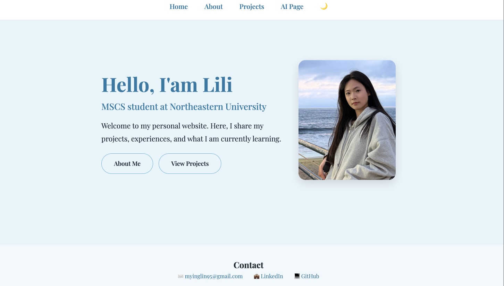
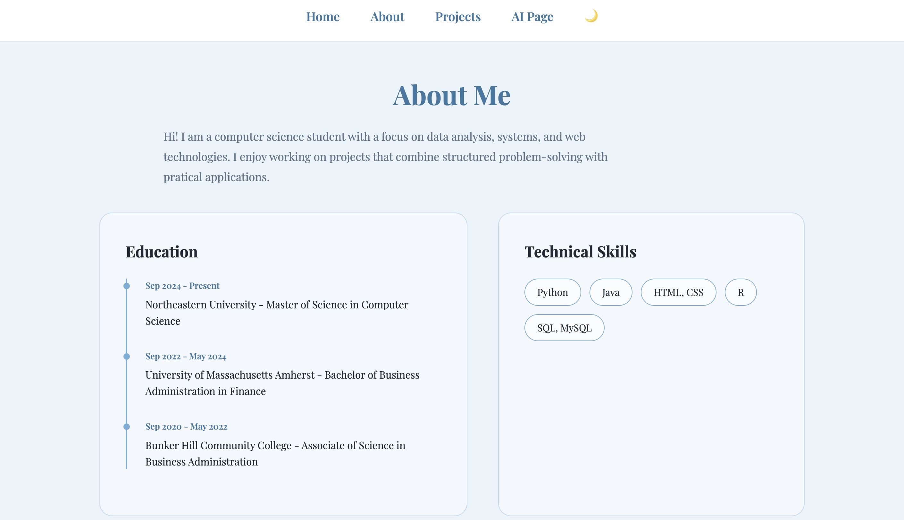
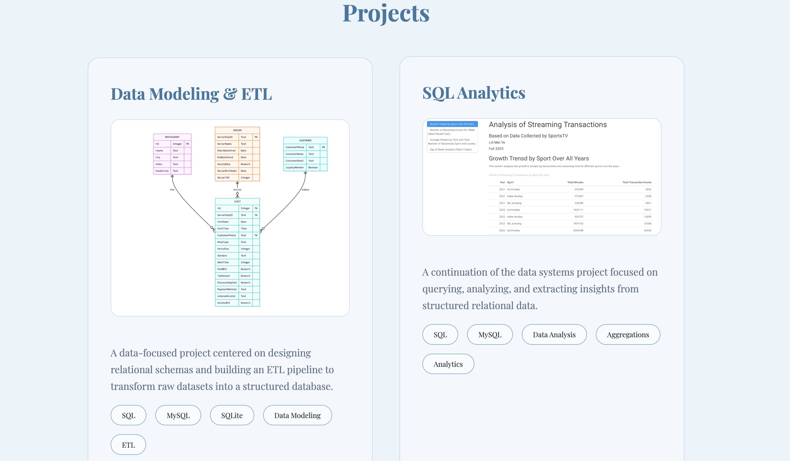
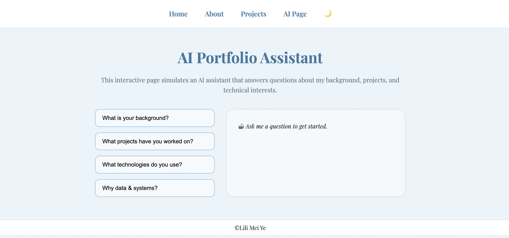
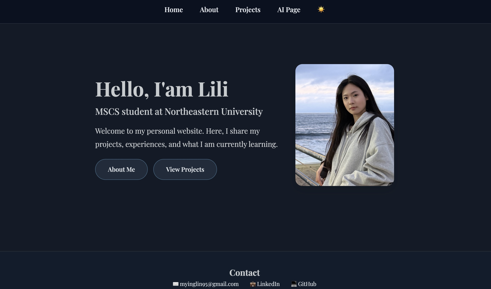

# Personal Homepage - Lili Mei Ye

## Project Objective
The objective of this project is to design and implement a personal homepage as a publicly accessible static website using **vanilla HTML5, CSS3, and ES6+ JavaScript modules**. The site presents personal background, selected projects, and interactive features through a clean and organized layout.

## Overview
**Author:** Lili Mei Ye\
**Email:** meiye.l@northeastern.edu\
**Class Information:** 
- [CS5610 Web Development](https://johnguerra.co/classes/webDevelopment_online_spring_2026/index.html)
- Spring 2026
- Northeastern University

**Links:** 
- [Personal Website](https://myinglin2333.github.io/PersonalHomepage/)
- [GitHub Link](https://github.com/myinglin2333/PersonalHomepage#)
- [Design Document](Design%20Document.pdf)
- [Video Demonstration](https://drive.google.com/file/d/1ZGGzCQu7hfrsNn_VyJ-FMDrUUjGyBvEY/view?usp=sharing)
- [Google Slides](https://docs.google.com/presentation/d/133mOgi37yqGfuGJyvEy9UKSXzqjlSwXg1uO85L8xPQs/edit?usp=sharing)

## Technologies Used
- HTML5
- CSS3
- JavaScript (ES6+ Modules)

## Features
- 🌗 **Light/Dark Theme Toggle**
    - Implemented using JavaScript
    - User preference persisted with 'localStorage'
- 🤖 **AI Interactive Page**
    - User interaction with dynamically generated responses

## Screenshot
### Homepage


### About page


### Projects page


### AI page


### Dark mode


## Instructions to Build and Run
**To view the site locally:**
1. Clone the repository:
```
git clone https://github.com/myinglin2333/PersonalHomepage.git
```
2. Open directly in browser:
    - Double-click `index.html` in the folder
    - Or drag `index.html` to your browser window
    - **Supported browsers:** Chrome, Safari, Firefox


## Use of Generative AI Tools
Generative AI tools were used to assist with ideation and content refinement.
- **Tool:** ChatGPT (OpenAI)
- **Usage:**
    - Refining written content
    - Assisting with CSS layout debugging
    - Generated sample content for AI Page (`ai.html`) 

*Note: All AI-generated content was reviewed, modified, and integrated manually to ensure quality and compliance with project requirements.*

## License
This project is licensed under the **MIT License**.

See the [MIT License](LICENSE) file for details.


